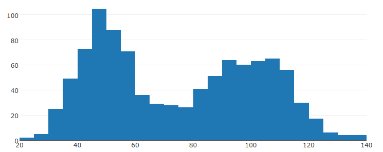
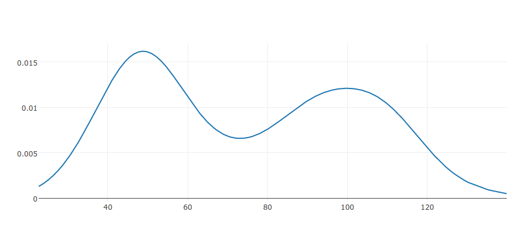

# distfitjs

This is a JavaScript library that fits theoretical distributions to data.
It can be used in node.js or the browser (via distfit.min.js).
Fitting is done using **both parametric and non-parametric methods.**
Distfitjs is lightweight and has no dependencies.

## Examples
See the `examples/` directory.

Given some data:

Compute a (Gaussian) kernel density estimate:

## Basic Usage

## Documentation
Grunt is used as a task runner for distfit. 
There are two available grunt tasks:

+ Generating documentation from the source: `grunt jsdoc`
+ Running tests: `grunt mochaTest`

See `Gruntfile.js` for details.

For web applications, `distfit.min.js` can be generated by running `npm run build-browser`.
This uses Browserify to concatenate the source and expose `require`.

## License
The MIT License

Copyright (c) 2016 Daniel Levin

Permission is hereby granted, free of charge, to any person obtaining a copy
of this software and associated documentation files (the "Software"), to deal
in the Software without restriction, including without limitation the rights
to use, copy, modify, merge, publish, distribute, sublicense, and/or sell
copies of the Software, and to permit persons to whom the Software is
furnished to do so, subject to the following conditions:

The above copyright notice and this permission notice shall be included in
all copies or substantial portions of the Software.

THE SOFTWARE IS PROVIDED "AS IS", WITHOUT WARRANTY OF ANY KIND, EXPRESS OR
IMPLIED, INCLUDING BUT NOT LIMITED TO THE WARRANTIES OF MERCHANTABILITY,
    FITNESS FOR A PARTICULAR PURPOSE AND NONINFRINGEMENT. IN NO EVENT SHALL THE
    AUTHORS OR COPYRIGHT HOLDERS BE LIABLE FOR ANY CLAIM, DAMAGES OR OTHER
    LIABILITY, WHETHER IN AN ACTION OF CONTRACT, TORT OR OTHERWISE, ARISING FROM,
    OUT OF OR IN CONNECTION WITH THE SOFTWARE OR THE USE OR OTHER DEALINGS IN
    THE SOFTWARE.

## Contributing
Development is done on Github.
Issues and pull requests are the simplest way to contribute :)
